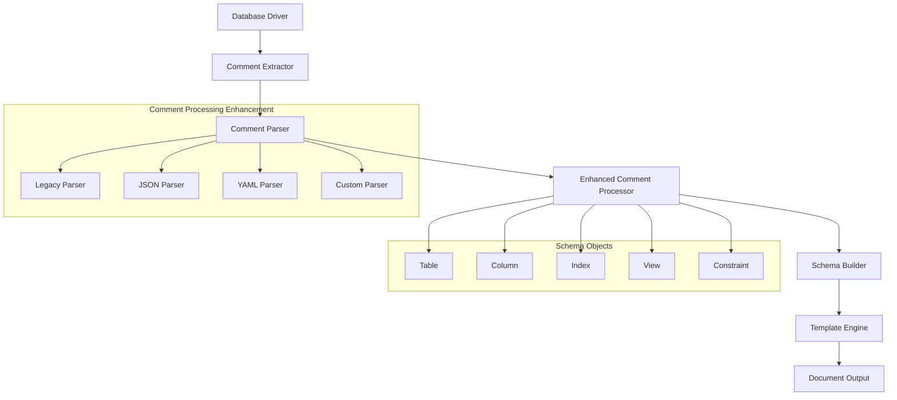

# 詳細設計書 - データベースコメントからの論理名・説明読み取り機能強化

## 1. アーキテクチャ概要

### 1.1 システム構成図



### 1.2 技術スタック

- **言語**: Go 1.23.8+
- **フレームワーク**: なし（標準ライブラリベース）
- **ライブラリ**: 
  - `encoding/json` (JSONコメント解析)
  - `gopkg.in/yaml.v3` (YAMLコメント解析) ※既存依存
  - `strings` (テキスト処理)
  - `regexp` (正規表現処理)
- **ツール**: 
  - `go test` (テスト)
  - `golangci-lint` (Lint)

## 2. コンポーネント設計

### 2.1 コンポーネント一覧

| コンポーネント名 | 責務 | 依存関係 |
|-----------------|------|----------|
| CommentParser | コメント解析の統合インターフェース | LegacyParser, JSONParser, YAMLParser |
| LegacyParser | 従来の区切り文字ベース解析 | SplitCommentParts |
| JSONParser | JSON形式コメント解析 | encoding/json |
| YAMLParser | YAML形式コメント解析 | gopkg.in/yaml.v3 |
| CommentValidator | 論理名・説明の検証・サニタイズ | - |
| ErrorHandler | エラー処理とフォールバック | - |
| EnhancedCommentProcessor | コメント処理の統合制御 | CommentParser, CommentValidator |

### 2.2 各コンポーネントの詳細

#### CommentParser (新規)

- **目的**: 複数の解析方式を統合し、適切なパーサーを選択
- **公開インターフェース**:
  ```go
  type CommentParser interface {
      ParseComment(comment string, delimiter string) (*CommentData, error)
      CanParse(comment string) bool
      Priority() int
  }

  type CommentData struct {
      LogicalName string            `json:"name,omitempty"`
      Description string            `json:"description,omitempty"`
      Tags        []string          `json:"tags,omitempty"`
      Metadata    map[string]string `json:"metadata,omitempty"`
  }
  ```
- **内部実装方針**: パーサーチェーンパターンで各パーサーを順次試行

#### EnhancedCommentProcessor (新規)

- **目的**: コメント処理全体の統合制御
- **公開インターフェース**:
  ```go
  type EnhancedCommentProcessor struct {
      parsers    []CommentParser
      validator  CommentValidator
      config     *config.Config
  }

  func (p *EnhancedCommentProcessor) ProcessComment(comment string, objType ObjectType) (*CommentData, error)
  func (p *EnhancedCommentProcessor) RegisterParser(parser CommentParser)
  ```
- **内部実装方針**: 設定に基づく解析方式の選択とフォールバック処理

#### JSONParser (新規)

- **目的**: JSON形式コメントの解析
- **公開インターフェース**:
  ```go
  type JSONParser struct{}

  func (p *JSONParser) ParseComment(comment string, delimiter string) (*CommentData, error)
  func (p *JSONParser) CanParse(comment string) bool
  ```
- **内部実装方針**: JSON形式の検証後、構造化データとして解析

#### CommentValidator (新規)

- **目的**: 解析結果の検証とサニタイズ
- **公開インターフェース**:
  ```go
  type CommentValidator struct {
      maxLength      int
      allowedChars   *regexp.Regexp
      duplicateCheck map[string]bool
  }

  func (v *CommentValidator) ValidateLogicalName(name string) error
  func (v *CommentValidator) SanitizeDescription(desc string) string
  ```

## 3. データフロー

### 3.1 データフロー図

```
[DB Comment] --> [Comment Extractor] --> [Enhanced Comment Processor]
                                                    |
                                                    v
                                            [Parser Selection]
                                                    |
                                    +---------------+---------------+
                                    |               |               |
                                    v               v               v
                              [JSON Parser]   [YAML Parser]   [Legacy Parser]
                                    |               |               |
                                    +-------+-------+---------------+
                                            |
                                            v
                                    [Comment Validator]
                                            |
                                            v
                                    [Schema Object Update]
                                            |
                                            v
                                    [Template Rendering]
```

### 3.2 データ変換

- **入力データ形式**: 
  - 従来形式: `"論理名|説明文"`
  - JSON形式: `{"name": "論理名", "description": "説明", "tags": ["tag1"]}`
  - YAML形式: `name: 論理名, description: 説明`
- **処理過程**: 
  1. フォーマット自動検出
  2. 適切なパーサーでの解析
  3. CommentData構造への統一
  4. 検証・サニタイズ
- **出力データ形式**: CommentData構造体（統一形式）

## 4. APIインターフェース

### 4.1 内部API

```go
// Enhanced comment processing interface
type ICommentProcessor interface {
    ProcessTableComment(comment string, table *schema.Table) error
    ProcessColumnComment(comment string, column *schema.Column) error
    ProcessIndexComment(comment string, index *schema.Index) error
    ProcessViewComment(comment string, view *schema.Table) error
    ProcessConstraintComment(comment string, constraint *schema.Constraint) error
}

// Parser registration interface
type ParserRegistry interface {
    RegisterParser(parser CommentParser)
    GetParsers() []CommentParser
    ParseWithFallback(comment string, delimiter string) (*CommentData, error)
}

// Configuration extension
type CommentConfig struct {
    Enabled         bool                `yaml:"enabled"`
    Parsers         []string            `yaml:"parsers,omitempty"` // ["legacy", "json", "yaml"]
    JSONEnabled     bool                `yaml:"jsonEnabled"`
    YAMLEnabled     bool                `yaml:"yamlEnabled"`
    ValidatorConfig ValidatorConfig     `yaml:"validator,omitempty"`
}

type ValidatorConfig struct {
    MaxLogicalNameLength int      `yaml:"maxLogicalNameLength,omitempty"`
    AllowedNamePattern   string   `yaml:"allowedNamePattern,omitempty"`
    DuplicateCheck       bool     `yaml:"duplicateCheck"`
}
```

### 4.2 外部API

既存のschema.Column/Tableのメソッドを拡張:

```go
// Enhanced methods for schema objects
func (c *Column) SetLogicalNameFromCommentEnhanced(processor ICommentProcessor) error
func (t *Table) SetLogicalNameFromCommentEnhanced(processor ICommentProcessor) error

// New methods for additional object types
func (i *Index) SetLogicalNameFromComment(processor ICommentProcessor) error
func (v *schema.Table) SetViewLogicalNameFromComment(processor ICommentProcessor) error // for views
func (c *Constraint) SetLogicalNameFromComment(processor ICommentProcessor) error
```

## 5. エラーハンドリング

### 5.1 エラー分類

- **ParseError**: コメント解析失敗
  - 対処方法: レガシーパーサーへのフォールバック
- **ValidationError**: 論理名検証失敗
  - 対処方法: 警告ログ出力、物理名へのフォールバック
- **FormatError**: 不正なコメント形式
  - 対処方法: 部分的な情報の抽出または空文字列での継続
- **ConfigurationError**: 設定値の問題
  - 対処方法: デフォルト値での継続処理

### 5.2 エラー通知

- **ログレベル**: 
  - ERROR: 処理を中断する重大な問題
  - WARN: 処理は継続するが注意すべき問題
  - DEBUG: 解析過程の詳細情報
- **エラーメッセージ**: 日本語での明確な説明と解決方法の提示
- **メトリクス**: 解析成功率、エラー種別の統計情報

## 6. セキュリティ設計

### 6.1 データ保護

- **入力サニタイズ**: 
  - SQLインジェクション対策（特殊文字のエスケープ）
  - XSS対策（HTML特殊文字の処理）
  - パス・トラバーサル対策（ファイルパス文字の検証）

### 6.2 制限事項

- **JSON解析深度制限**: 無限ループ防止のため最大深度を5に制限
- **文字列長制限**: メモリ消費制御のため論理名255文字、説明2048文字に制限
- **解析タイムアウト**: 長時間処理防止のため1秒でタイムアウト

## 7. テスト設計

詳細なテスト設計については、`/test-design`コマンドを実行してテスト設計書を作成してください。

テスト設計書では以下の内容を定義します：

- 正常系・異常系・境界値テストケース
- テストデータ設計  
- パフォーマンス・セキュリティテスト
- 自動化戦略

## 8. パフォーマンス最適化

### 8.1 想定される負荷

- **大規模DB**: 1000テーブル、10000カラムでのコメント処理
- **解析処理時間**: 1テーブルあたり平均1ms以内
- **メモリ使用量**: 現在の1.1倍以内に抑制

### 8.2 最適化方針

- **パーサー選択の最適化**: フォーマット検出を最小限の文字数で実行
- **キャッシュ機能**: 同一コメントの重複解析を回避
- **並行処理**: ゴルーチンプールでのテーブル並行処理
- **メモリプール**: CommentData構造体の再利用

## 9. デプロイメント

### 9.1 デプロイ構成

単一バイナリでの配布を維持し、既存のデプロイ方式に変更なし

### 9.2 設定管理

`.tbls.yml`の拡張:

```yaml
# Enhanced comment processing configuration
comment:
  enabled: true
  parsers: ["legacy", "json", "yaml"]
  json:
    enabled: true
  yaml:
    enabled: true
  validator:
    maxLogicalNameLength: 255
    allowedNamePattern: '^[a-zA-Z0-9_\u3040-\u309F\u30A0-\u30FF\u4E00-\u9FAF\s-]+$'
    duplicateCheck: true

# Backward compatibility maintained
logicalName:
  enabled: true
  delimiter: "|"
  fallbackToName: false
  table:
    enabled: true
    delimiter: "|"
    fallbackToName: false
    displayFormat: "{{.LogicalName}}"
```

## 10. 実装上の注意事項

- **後方互換性**: 既存の`SetLogicalNameFromComment`メソッドは非推奨だが動作を維持
- **段階的移行**: まずはオプトイン形式で新機能を提供、将来的にデフォルト化
- **エラー処理**: 新機能で問題が発生しても既存の動作に影響しない設計
- **テストカバレッジ**: 全ての新機能に対して90%以上のテストカバレッジを維持
- **ドキュメント**: 設定例とマイグレーションガイドを含む詳細な日本語ドキュメント
- **プラグイン対応**: 将来的なカスタムパーサー追加のため、インターフェースベースの設計を採用

## 11. 実装フェーズ

### フェーズ1: コア機能実装
1. EnhancedCommentProcessor の基本実装
2. JSONParser の実装
3. CommentValidator の実装
4. 基本的なテストケースの作成

### フェーズ2: 機能拡張
1. YAMLParser の実装
2. 複数オブジェクトタイプへの対応拡張
3. 設定システムの拡張
4. エラーハンドリングの強化

### フェーズ3: 最適化・安定化
1. パフォーマンス最適化
2. 包括的なテストケース追加
3. ドキュメント整備
4. 既存システムとの統合テスト